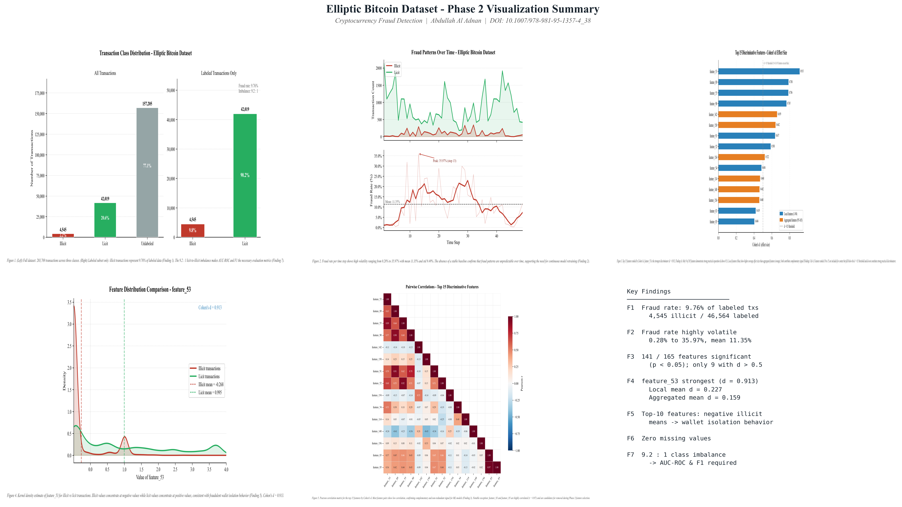

# Cryptocurrency Fraud Detection

## Motivation

This project extends and experimentally explores 
concepts introduced in my published Springer paper:

"Forensic Analysis of Cryptocurrency Transactions: 
Leveraging Blockchain for Fraud Detection and 
Regulatory Compliance" - ICTIS 2025, Springer. 
DOI: 10.1007/978-981-95-1357-4_38

The goal is to empirically validate whether machine 
learning can automatically detect illicit Bitcoin 
transactions, reducing the need for manual forensic 
investigation.

## Datasets

### Primary Dataset - Elliptic Bitcoin Dataset
- 203,769 real Bitcoin transactions
- 166 features per transaction
- Labels: illicit (fraud), licit (normal), unknown
- Source: Elliptic blockchain analytics firm
- Directly connected to cryptocurrency forensics 
  research

### Preliminary Dataset - IEEE-CIS Fraud Detection
- 590,540 e-commerce transactions
- Used for methodology validation only
- Different domain from cryptocurrency
- Source: Kaggle

## Research Questions

1. Which transaction features best distinguish 
   illicit from licit Bitcoin transactions?

2. How do network and graph features compare to 
   local transaction features for fraud detection?

3. Which ML model performs best under class 
   imbalance conditions?

4. How do fraud patterns evolve across time steps?

5. Can ML provide explainable predictions that 
   satisfy regulatory compliance requirements 
   such as FATF and EU MiCA?

## Key Findings

### Phase 1 - Exploratory Data Analysis

Finding 1: Fraud rate is 9.76% among labeled 
transactions (4,545 illicit out of 46,564 labeled). 
This reflects fraud prevalence in transactions 
investigated by Elliptic analysts.

Finding 2: Illicit transaction rates exhibit high 
temporal volatility across 49 time steps, ranging 
from 0.28% to 35.97% (mean 11.35%, std 9.49%). 
The peak occurs at step 13 (35.97%) with no stable 
baseline detected. This volatility confirms that 
fraud patterns are unpredictable and adaptive 
detection systems with continuous model retraining 
are required.

Finding 3: 141 out of 165 features show statistically 
significant differences between illicit and licit 
transactions (p less than 0.05). However only 9 
features demonstrate strong practical separation 
(Cohen's d above 0.5), confirming that statistical 
significance alone is insufficient in large datasets 
and effect size is the more meaningful measure.

Finding 4: feature_53 is the strongest individual 
discriminator (Cohen's d = 0.913, p less than 0.001, 
large effect size). Local transaction features 
demonstrate higher average effect sizes across all 
features (mean d = 0.227 vs 0.159 for aggregated 
features), suggesting both feature types play 
complementary roles in fraud detection.

Finding 5: All top 10 discriminative features show 
negative mean values for illicit transactions and 
positive mean values for licit transactions, 
consistent with fraudulent wallet isolation behavior 
in the Bitcoin network.

Finding 6: The dataset contains zero missing values 
and is clean and ready for machine learning without 
additional preprocessing.

Finding 7: The dataset exhibits a 9.2 to 1 class 
imbalance. A naive classifier predicting all 
transactions as licit achieves 90.24% accuracy 
while detecting zero fraud cases, confirming that 
AUC-ROC and F1 score are required evaluation metrics.

### Phase 1 Extension - Statistical Validation

Mann-Whitney U tests confirm 141 of 165 features 
show statistically significant differences 
(p less than 0.05). Cohen's d effect size analysis 
using the corrected pooled standard deviation formula 
reveals only 9 features demonstrate strong practical 
separation (d above 0.5). Local features show higher 
average effect sizes (mean d = 0.227) than aggregated 
features (mean d = 0.159), though feature_53 remains 
the strongest individual discriminator (d = 0.913). 
All findings independently verified using the 
complete dataset.

## Phase 2 Visualization

| Figure | Finding |
|--------|---------|
| Fig 1 - Class Distribution | Findings 1 and 7: fraud rate 9.76%, class imbalance 9.2 to 1 |
| Fig 2 - Fraud Rate Over Time | Finding 2: volatility 0.28% to 35.97%, mean 11.35%, peak step 13 |
| Fig 3 - Top 15 Features | Findings 3 and 4: 9 of 165 features exceed d = 0.5, feature_53 strongest at d = 0.913 |
| Fig 4 - KDE feature_53 | Finding 5: illicit mean -0.268 vs licit mean 0.995, wallet isolation behavior |
| Fig 5 - Correlation Heatmap | Finding 3: complementary signal confirmed among top 15 features |

## Project Phases

Phase 1 - Baseline analysis on IEEE-CIS dataset 
(completed)

Phase 1 - Exploratory data analysis on Elliptic 
Bitcoin dataset (completed)

Phase 1 Extension - Statistical validation with 
Mann-Whitney U test and Cohen's d (completed)

Phase 2 - Visualization and pattern analysis 
(completed)

Phase 3 - Machine learning models including 
Logistic Regression, Random Forest, and XGBoost 
(pending)

Phase 4 - SHAP explainability analysis (pending)

Phase 5 - Results write-up and paper draft (pending)

## Tools

Python, NumPy, Pandas, Matplotlib, Seaborn, 
SciPy, Scikit-learn, SHAP

## Limitations and Future Work

This project applies tabular machine learning to 
graph-structured blockchain data. Future work will 
explore Graph Neural Networks including GraphSAGE 
and GCN on the transaction network structure. 
Statistical significance testing will be extended 
to include mutual information and permutation 
importance in Phase 3.

## Author

Abdullah Al Adnan
MS Information Technology - Emporia State University
Email: abdullah.adnan112@gmail.com
GitHub: github.com/AbdullahAlAdnan

## Related Publication

This project extends:

Nafiz Eashrak, Mohammad Ikbal Hossain, 
Md. Omum Siddique Auyon, Abdullah Al Adnan. (2026).
Forensic Analysis of Cryptocurrency Transactions: 
Leveraging Blockchain for Fraud Detection and 
Regulatory Compliance. Springer ICTIS 2025.
DOI: 10.1007/978-981-95-1357-4_38

## License

This project is open source and available 
under the MIT License.
